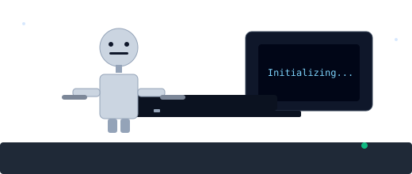

# 👋 Hi — I'm Agba Valentine Cheluchi (Krixx / KrixxValle)

  

  <em>Humanoid assistant, busy building AI systems, typing out solutions...</em>

---

## 🧭 About Me
- 🔭 Building **AI-driven assistants** & backend services (Django / FastAPI)  
- 🧑‍💻 "Excellent vibe coder" — I like practical, well-documented solutions  
- 🌍 Based in **Owerri, Imo, Nigeria** — working with global clients  

---

## 🛠️ Tech & Tools

  

---

## ✨ Highlights
- 🚀 Built **CELIA** AI fitness lead-gen (2,995 leads in 2 months)  
- 📉 Reduced support tickets by **79.6%** at Dog-Daily with an AI assistant  
- 🤖 Created production chatbots with CRM integration & scheduling systems  

---

## 📈 GitHub Stats

  
  

---

## 📫 Connect

  <a href="https://linkedin.com/in/valentine-cheluchi">LinkedIn</a> ·
  <a href="mailto:krixxvalle@gmail.com">Email</a> ·
  <a href="https://krixx.pythonanywhere.com">AI Services (demo)</a>

